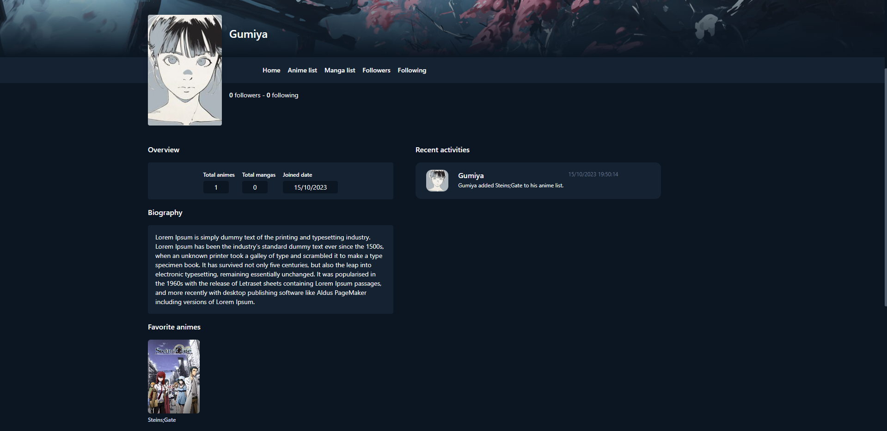
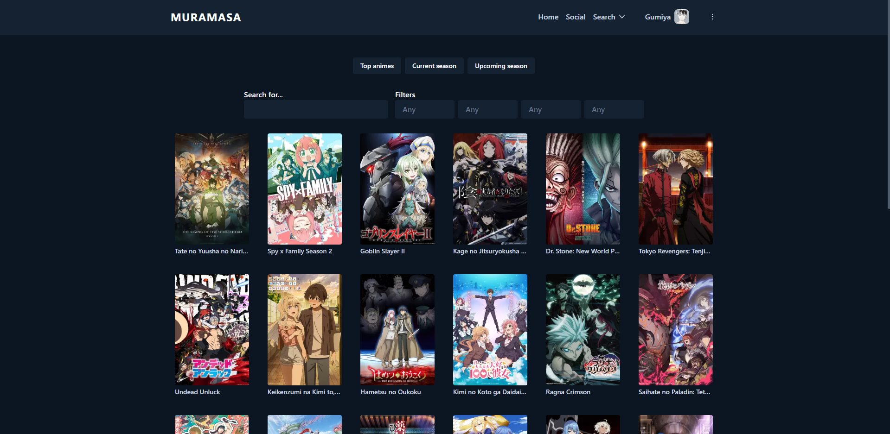

# muramasa-reloaded
Simple web application with Spring Boot as backend and ReactJS as frontend. An anime/manga management and social media like.

## Features
* User authentication and creation;
* Save anime in your anime list; save manga in your manga list;
* Can select how many episodes/chapters read;
* Can select what is the current statuses (watching/reading, completed, plan to watch/plan to read, dropped, on hold);
* Can favorite;
* Can write reviews and see other's review in the anime/manga page;
* Customize profile (not finished);
* Search for anime and manga with specified filters like year and season;
* Favorite characters;
* Follow and unfollow another users;
* Log system; a log is created when a user takes an action (like following another user or adding an anime to the list);
* Users that are following you can see your logs;
* Post/forum system (not finished);

## Todo
* Finish post/forum system;
* Optimize code;
* Containerize the application;
* Host the application;
* Finish profile customization;

## Pictures
<<<<<<< HEAD

=======

>>>>>>> 43f3aac9885b7b44b211bd493ba3fe8560bcfadd
